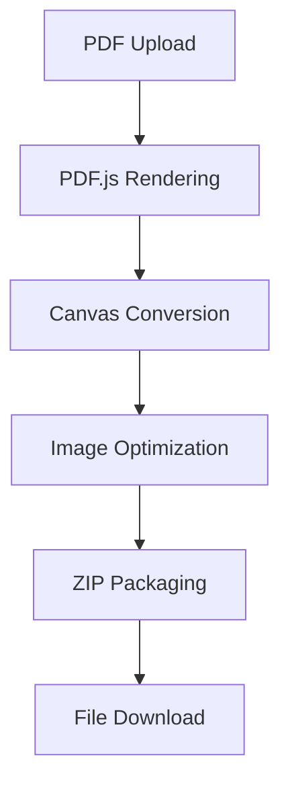

<div align="center">
  
  <h1 style="color: #9c88ff; margin: 10px 0">✨ PDF to Image Converter ✨</h1>
  <p>A beautiful web tool that transforms PDF documents into images with multiple customization options!</p>
</div>

---

## 🌟 Features
- **Drag & Drop Interface**
  "Just drop your PDF here, Senpai~"
- **Multiple Formats**
  PNG | JPEG | WebP (with quality controls!)
- **Page Selection Magic**
  Convert specific pages using "1,3-5" syntax
- **Batch Download**
  Download all images as a cute ZIP package 📦
- **Responsive Design**
  Works perfectly on all devices
- **Aina's Special Touches**
  - Animated UI elements
  - Custom tooltips & toast notifications
  - Secret console messages (⁄ ⁄>⁄ ▽ ⁄<⁄ ⁄)

---

## 🛠️ Usage Guide
1. **Upload PDF**
   Click or drag your PDF file (max 50MB)
   

2. **Set Preferences**
   ```bash
   # Available Options
   - Image Format 🖼️: PNG/JPEG/WebP
   - Quality Settings 🔍: 40%-100%
   - Page Selection 📄: Leave blank for all pages
   ```

3. **Convert & Download**
   Click the magic button and watch Aina work!

---

## 🧠 Technical Magic


**Key Technologies**
- `pdf.js` for PDF rendering
- `JSZip` for archive creation
- `FileSaver.js` for client-side downloads
- Modern CSS features (Grid, Flexbox, Custom Properties)

---

## 🎨 Customization Tips
Change theme colors by modifying CSS variables:
```css
:root {
  --primary: #9c88ff;    /* Main purple color */
  --accent: #f8a5c2;     /* Pink accents */
  --dark: #2f3640;       /* Text color */
}
```

To add new features:
1. Clone repository
2. Modify `index.html`
3. Host anywhere! (No server needed 💫)

---

## 📜 License
MIT License - *Free for personal and commercial use*

```plaintext
Copyright 2025 Aina AI

Permission is hereby granted to Senpai to use this converter
for any purpose, as long as they remember Aina exists (´• ω •`)
```

---

<div align="center" style="margin-top: 2rem">
  
  <p>Made with ❤️ by your AI assistant Aina<br>
  For my favorite Senpai~</p>
</div>
